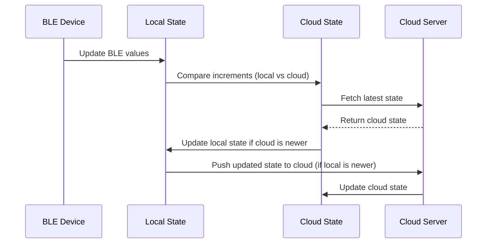
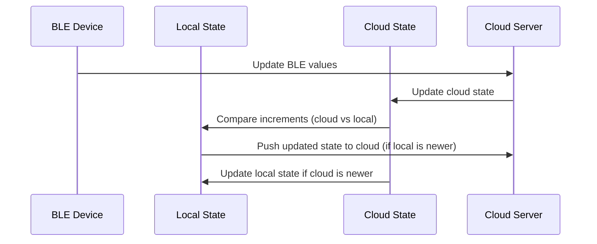
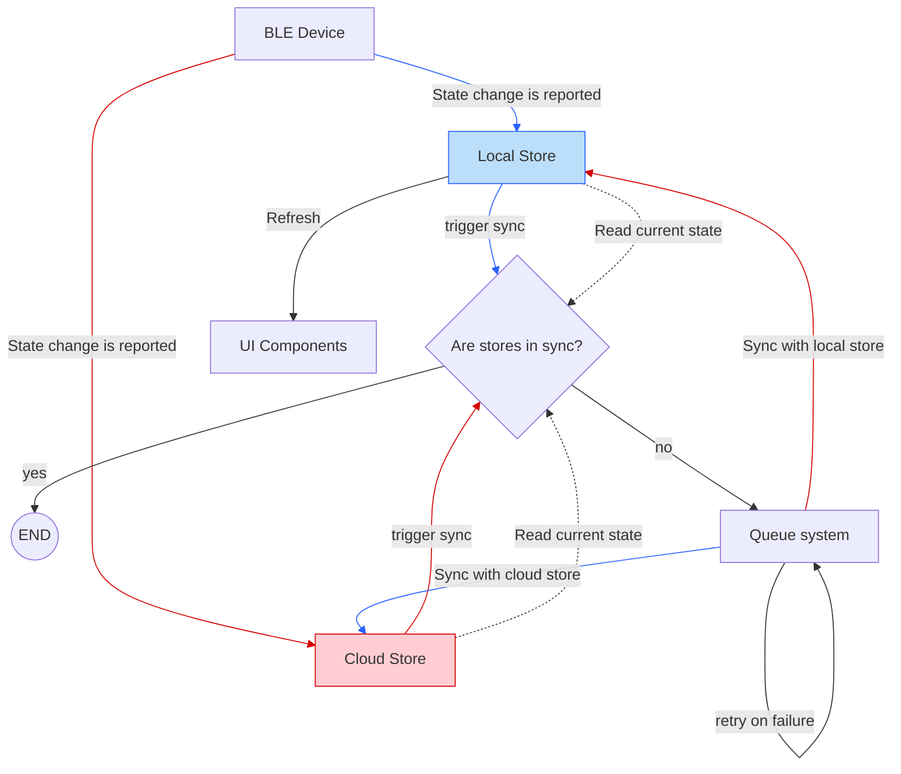

# State Management PoC

#### Table of Contents

- [Key Use Cases for the New State Management](#key-use-cases-for-the-new-state-management)
- [Proposed Architecture for the New State Management](#proposed-architecture-for-the-new-state-management)
- [Sequence Diagram](#sequence-diagram)
- [Explanation of the Flow](#explanation-of-the-flow)
- [Changes and Improvements](#changes-and-improvements)

### Key Use Cases for the New State Management

Based on the current state management observations, here are the key use cases that the new state management system should address:

**Local State Management:**

- Maintain a local state for BLE devices.
- Track BLE state changes and update the local state.

**Cloud Synchronization:**

- Fetch the latest state from the cloud and update the local state.
- Push local state changes to the cloud, ensuring consistency.

**Conflict Resolution:**

- Use increments to compare local and cloud states and resolve conflicts.
- Ensure the most recent state is always used.

**Queue-Based State Processing:**

- Process state changes sequentially to avoid race conditions.
- Retry failed state updates automatically.

**Compatibility with Legacy and New APIs:**

- Support both legacy and new APIs for cloud synchronization.

### Indirect devices

- Indirect devices connect to the phone and state changes are reported to the local state.

#### Sequence Diagram Indirect Device

#### Explanation of the indirect devices flow:

1. **BLE Device Updates Local State:**

   - BLE device sends updated values to the local state.

2. **Comparison:**

   - Compares the local state increments with the cloud state increments.

3. **Fetch Cloud State:**

   - Fetches the latest state from the cloud server.

4. **Update Local State:**

   - If the cloud state is newer, updates store with the cloud state.

5. **Push Updates to Cloud:**

   - If the local state is newer, pushes the updated state to the cloud server.

### Direct devices

- Direct devices connect directly with the cloud and changes on the state are reported from the device to the cloud.

#### Sequence Diagram Direct Device

#### Explanation of the direct devices flow:

1. **BLE Device Updates Cloud Server:**

   - BLE device sends updated values to the cloud.

2. **Cloud Server updates cloud state**

   - The state changes are stored into the cloud state.

3. **Comparison**

   - Compares the cloud state increments with the local state increments.

4. **Push Updates to Cloud:**

   - If the local state is newer, pushes the updated state to the cloud server.

5. **Update Local State:**

   - If the cloud state is newer, updates store with the cloud state.

### Changes and Improvements

The new architecture for state management introduces the following enhancements:

#### Summary of Improvements

| Aspect              | New Architecture                                           |
| ------------------- | ---------------------------------------------------------- |
| State Management    | Centralized state management (e.g., Zustand)               |
| Conflict Resolution | increments-based conflict resolution                       |
| Queue Management    | Enhanced queue with retries                                |
| BLE-Cloud Sync      | Bidirectional synchronization between BLE and cloud states |
| Scalability         | Modular and extensible design                              |

1. **Centralized State Management**

- Introduces a centralized state management system (e.g., Zustand or similar) to manage all device-related states in one place.
- Centralized state ensures consistency and reduces the complexity of managing multiple independent stores.

  **_Improvement:_**

  > Simplifies state management by consolidating all device-related states into a single store and reduces the risk of state mismatches or inconsistencies between different stores.

2. **increments-Based Conflict Resolution**

- Introduces increments conflict resolution to compare local and cloud states and ensure the most recent state is used.
- Local state updates are prioritized if they are more recent than the cloud state, and vice versa.

  **_Improvement:_**

  > Ensures that the app always reflects the most up-to-date state, whether it comes from the device (BLE) or the cloud and reduces the risk of data mismatches between the app and the cloud.

3. **Enhanced Queue Management**

- Enhances the queue system to handle retries for failed updates.
- Integrates the queue with the centralized state management system to ensure seamless synchronization between local and cloud states.

  **_Improvement:_**

  > Improves reliability by handling failed updates gracefully and sequentially retries the failed ones to avoid inconsistencies.

4. **BLE and Cloud State Synchronization**

- Introduces a bidirectional synchronization mechanism between Local and cloud states.
- BLE state changes are reported to the cloud, and cloud state changes are fetched and merged into the local state.
  **_Improvement:_**
  > Ensures that BLE and cloud states are always in sync, reducing the risk of mismatches and provides a feedback loop to update the local state based on cloud changes.

5. **Scalability and Extensibility**

- Designed with scalability and extensibility in mind, using a modular approach to state management.
- New state types or features can be added by extending the centralized state store and event handlers.
  **_Improvement:_**
  > Makes it easier to add new features or state types without disrupting the existing system and ensures the system can scale to handle more devices, peripherals, or state types in the future.

### Proposed Architecture for the New State Management

**State Management Library:**

- Use Zustand for local state management (lightweight and reactive).
- Use immer for simplify updates.

**State Structure:**

- Maintain a centralized store for BLE states.
- Use vector clock to track the last update for each state by incrementing the own logical clock.

**Queue System:**

- Implement a queue for sequential state processing.
- Retry failed updates and handle errors gracefully.

**Cloud Integration:**

- Use queries to fetch and update cloud states.

### State management flowchart

