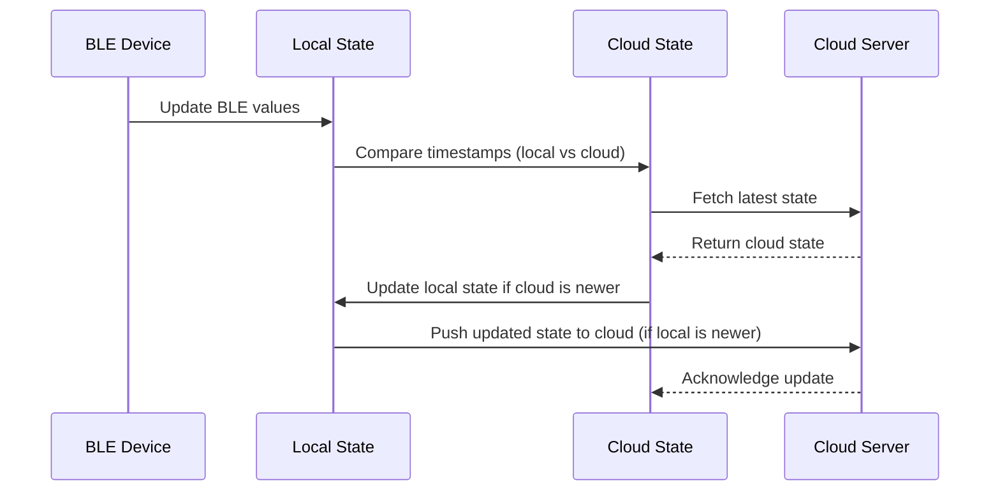
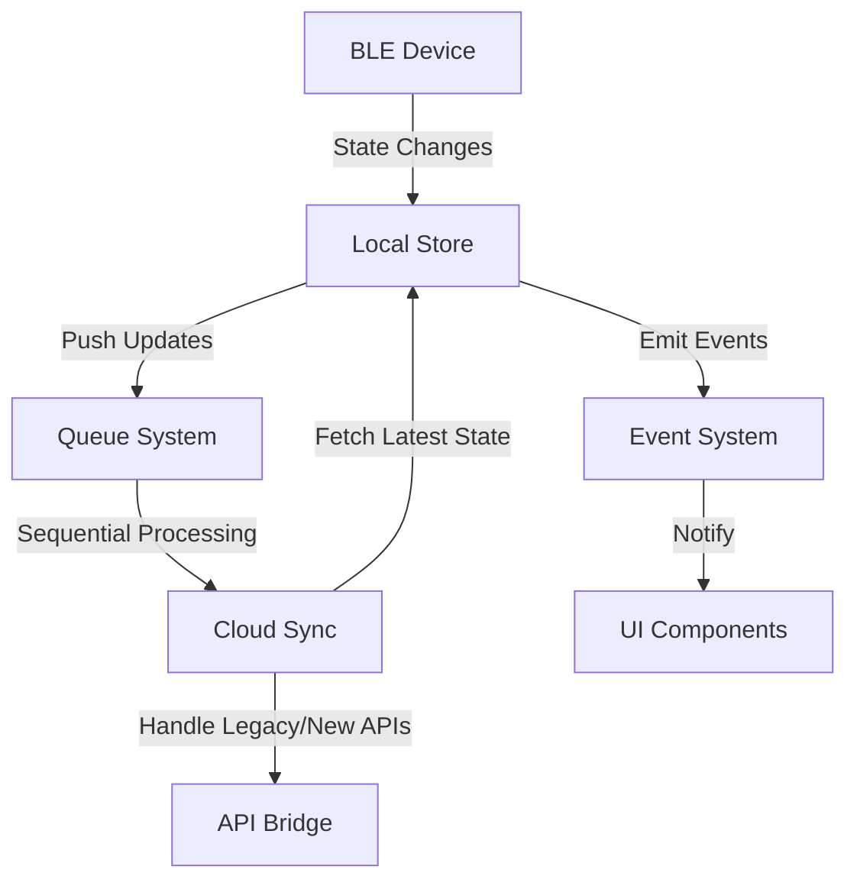

# State Management PoC

#### Table of Contents

- [Key Use Cases for the New State Management](#key-use-cases-for-the-new-state-management)
- [Proposed Architecture for the New State Management](#proposed-architecture-for-the-new-state-management)
- [Sequence Diagram](#sequence-diagram)
- [Explanation of the Flow](#explanation-of-the-flow)
- [Changes and Improvements](#changes-and-improvements)

### Key Use Cases for the New State Management

Based on the current state management observations, here are the key use cases that the new state management system should address:

**Local State Management:**

- Maintain a local state for BLE devices.
- Track BLE state changes and update the local state.

**Cloud Synchronization:**

- Fetch the latest state from the cloud and update the local state.
- Push local state changes to the cloud, ensuring consistency.

**Conflict Resolution:**

- Use timestamps to compare local and cloud states and resolve conflicts.
- Ensure the most recent state is always used.

**Queue-Based State Processing:**

- Process state changes sequentially to avoid race conditions.
- Retry failed state updates automatically.

**Event-Driven Updates:**

- Use event listeners to detect state changes and trigger updates.
- Emit events for state updates to notify other parts of the system.

**Compatibility with Legacy and New APIs:**

- Support both legacy and new APIs for cloud synchronization.
- Use the bridge to handle compatibility between APIs.

### Sequence Diagram

### Explanation of the Flow:

1. **BLE Device Updates Local State:**

   - BLE device sends updated values to the local state.

2. **Timestamp Comparison:**

   - Compares the local state timestamp with the cloud state timestamp.

3. **Fetch Cloud State:**

   - Fetches the latest state from the cloud server.

4. **Update Local State:**

   - If the cloud state is newer, updates store with the cloud state.

5. **Push Updates to Cloud:**

   - If the local state is newer, pushes the updated state to the cloud server.

6. **Cloud Acknowledges Update:**
   - The cloud server acknowledges the update, ensuring synchronization.

### Changes and Improvements

The new architecture for state management introduces the following enhancements:

#### Summary of Improvements

| Aspect              | Current Implementation                                 | New Architecture                                           |
| ------------------- | ------------------------------------------------------ | ---------------------------------------------------------- |
| State Management    | Multiple independent stores (bleStore, bleModuleStore) | Centralized state management (e.g., Zustand)               |
| Conflict Resolution | No explicit conflict resolution                        | Timestamp-based conflict resolution                        |
| Queue Management    | Sequential processing only                             | Enhanced queue with retries and prioritization             |
| Event Handling      | Tightly coupled with specific stores                   | Modular event-driven architecture                          |
| BLE-Cloud Sync      | Separate management of BLE and cloud states            | Bidirectional synchronization between BLE and cloud states |
| Scalability         | Hard to scale or extend                                | Modular and extensible design                              |
| Debugging           | Limited observability                                  | Built-in debugging tools from state management libraries   |
| BLE Module State    | Managed separately in bleModuleStore                   | Integrated into the centralized state store                |

1. **Centralized State Management**

- Introduces a centralized state management system (e.g., Zustand or similar) to manage all device-related states (BLE, MQTT, cloud synchronization) in one place.
- Centralized state ensures consistency and reduces the complexity of managing multiple independent stores.

  **_Improvement:_**

  > Simplifies state management by consolidating all device-related states into a single store and reduces the risk of state mismatches or inconsistencies between different stores.

2. **Timestamp-Based Conflict Resolution**

- Introduces timestamp-based conflict resolution to compare local and cloud states and ensure the most recent state is used.
- Local state updates are prioritized if they are more recent than the cloud state, and vice versa.

  **_Improvement:_**

  > Ensures that the app always reflects the most up-to-date state, whether it comes from the device (BLE) or the cloud and reduces the risk of data mismatches between the app and the cloud.

3. **Enhanced Queue Management**

- Enhances the queue system to handle retries for failed updates and prioritize critical state changes.
- Integrates the queue with the centralized state management system to ensure seamless synchronization between local and cloud states.

  **_Improvement:_**

  > Improves reliability by handling failed updates gracefully and ensuring critical state changes are processed first and provides better control over the order and priority of state updates.

4. **Event-Driven Architecture**

- Adopts a more modular event-driven architecture where events are decoupled from specific stores and handled by a centralized event handler.
- Events trigger updates to the centralized state store, which then propagates changes to the UI and cloud.
  **_Improvement:_**
  > Decouples event handling from specific stores, making the system more modular and easier to maintain and ensures that all state changes are processed consistently through the centralized state store.

5. **BLE and Cloud State Synchronization**

- Introduces a bidirectional synchronization mechanism between BLE and cloud states.
- BLE state changes are reported to the cloud, and cloud state changes are fetched and merged into the local state.
  **_Improvement:_**
  > Ensures that BLE and cloud states are always in sync, reducing the risk of mismatches and provides a feedback loop to update the local state based on cloud changes.

6. **Scalability and Extensibility**

- Designed with scalability and extensibility in mind, using a modular approach to state management.
- New state types or features can be added by extending the centralized state store and event handlers.
  **_Improvement:_**
  > Makes it easier to add new features or state types without disrupting the existing system and ensures the system can scale to handle more devices, peripherals, or state types in the future.

7. Improved Debugging and Observability

- Leverages state management libraries (e.g., Zustand, Redux) with built-in debugging tools to track state changes.
- Provides better observability into the state and queue processing.
  **_Improvement:_**
  > Makes it easier to debug state changes and identify issues in the state management system and improves developer productivity and reduces the time required to troubleshoot issues.

8. Unified State for BLE Modules

- Integrates BLE module state into the centralized state store, along with BLE connection states and device states.
- BLE module state changes are handled consistently with other state types.
  **_Improvement:_**
  > Reduces duplication and ensures consistency in how BLE module state is managed and reported and simplifies the codebase by consolidating BLE module state into the centralized state store.

### Proposed Architecture for the New State Management

**State Management Library:**

- Use Zustand for local state management (lightweight and reactive).
- Integrate use queries for cloud synchronization.

**State Structure:**

- Maintain a centralized store for BLE states.
- Use timestamps to track the last update for each state.

**Queue System:**

- Implement a queue for sequential state processing.
- Retry failed updates and handle errors gracefully.

**Event System:**

- Use an event-driven architecture to detect and handle state changes.
- Emit events for state updates to notify other parts of the system.

**Cloud Integration:**

- Use queries to fetch and update cloud states.
- Handle compatibility with legacy and new APIs using a bridge.

